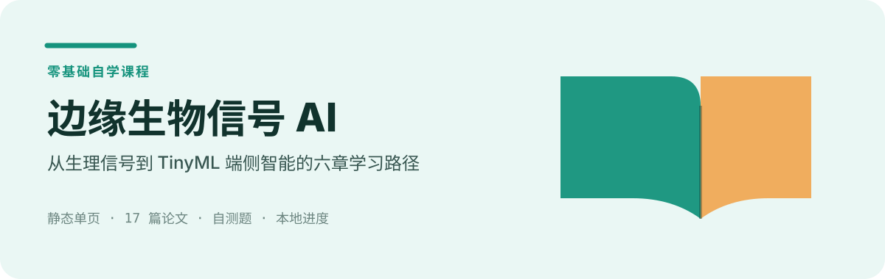

  

# 边缘生物信号 AI · 零基础教练课程

一套关于 **TinyML / 生物信号边缘 AI**(悉尼大学 Kavehei 课题组 / Zhaojing Huang 系列论文)的零基础自学课程。
纯静态单页 HTML,任何设备可读,进度本地保存。

## 在线学习
GitHub Pages: 部署后见仓库 **Settings → Pages** 给出的网址(形如 `https://<用户名>.github.io/<仓库名>/`)。

## 本地学习
直接用浏览器打开 `index.html` 即可。

## 内容
- 第 0 章 预备知识(引用 B站 / YouTube 优质视频)
- 第 1–6 章 主线串讲:紧凑骨架 → 两大应用 → TinyML → 神经形态 → 端侧训练/隐私/泛化 → 全图景
- 术语表 + 17 篇论文清单 + 每章自测题 + 进度跟踪

## 说明
- 本课程为 **AI 综合的学习导引**,F1/AUROC 等数字以论文 PDF 原文为准。
- 本仓库**不托管论文 PDF**(版权原因),仅含原创学习内容与外部链接。
